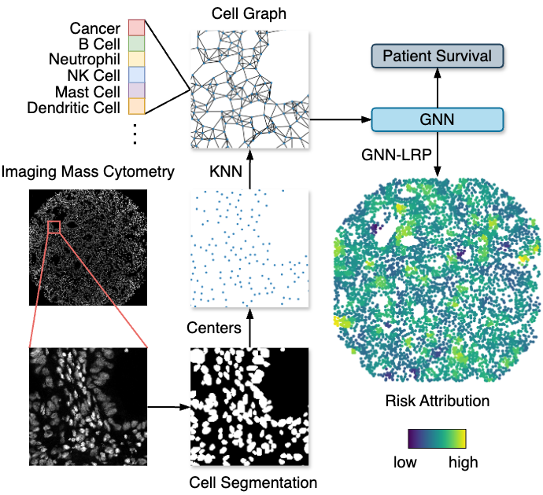

# Explainable Cell Graphs


[](https://arxiv.org/abs/2411.07643)

<b>xCG: Explainable Cell Graphs for Survival Prediction in Non-Small Cell Lung Cancer</b></br>
<em>Marvin Sextro*, Gabriel Dernbach*, Kai Standvoss, Simon Schallenberg, Frederick Klauschen, Klaus-Robert Müller, Maximilian Alber, Lukas Ruff</em></br>

\* These authors contributed equally</br>
Findings paper presented at Machine Learning for Health (ML4H) symposium 2024, December 15-16, 2024, Vancouver, Canada

<p align="center">
  
</p>

**Abstract**: Understanding how deep learning models predict oncology patient risk can provide critical insights into disease progression, support clinical decision-making, and pave the way for trustworthy and data-driven precision medicine. Building on recent advances in the spatial modeling of the tumor microenvironment using graph neural networks, we present an explainable cell graph (xCG) approach for survival prediction. We validate our model on a public cohort of imaging mass cytometry (IMC) data for 416 cases of lung adenocarcinoma. We explain survival predictions in terms of known phenotypes on the cell level by computing risk attributions over cell graphs, for which we propose an efficient grid-based layer-wise relevance propagation (LRP) method. Our ablation studies highlight the importance of incorporating the cancer stage and model ensembling to improve the quality of risk estimates. Our xCG method, together with the IMC data, is made publicly available to support further research.

## Setup

Before training cell graph models, you have to download and preprocess the external dataset, by running

```bash
python data/download_external_data.py
```

## Quick Start

In order to train a cell graph model, run

```bash
python cell_graphs/train.py config=base
```

## WandB Logging

Logging to WandB is optional and can be enabled by specifying an API key, the project and entity in a `.env` file in the root of the repository. You can take the following snippet as a template:

```bash
WANDB_API_KEY=
WANDB_ENTITY=
WANDB_PROJECT=
```

When running the train command from the quick start, simply enable WandB from the command line like below

```bash
python cell_graphs/train.py config=base config/wandb=base config.wandb.mode=online
```

## Repository Overview

The repository contains the following root-level folders:

* `cell_graphs` contains the code and configs to train cell graph models.
* `data` contains the downloaded raw and preprocessed data.
* `outputs` contains Hydra configs generated from individual training runs.
* `wandb` contains WandB logs.

## Entrypoint Scripts

To train/ensemble cell graph models, we provide four entrypoint scripts in `cell_graphs` which can be configured with Hydra:

* `train.py`: Train a cell graph model and evaluate on a single validation/test fold.
* `nested_cv.py`: Run nested cross-validation with hyperparameter tuning.
* `cv.py`: Run normal cross-validation over multiple seeds.
* `ensemble.py`: Ensemble risk predictions from a previous outer cross-validation run over multiple seeds.

Examples for their usage and specific configuration options can be found in the Experiments section below.

## Docker Image

The Docker image can be built for `linux/amd64` by running

```bash
docker buildx build -t cell-graphs .
```

When using VSCode, the Docker image is automatically built when using a Dev Container.

In order to update the dependencies of the image, install them inside the container and run

```bash
micromamba env export > environment.yaml
pip list --format=freeze > requirements.txt
```

## Unittests

Unittests can be ran by

```bash
python -m pytest
```

## Experiments

We provide the commands used to run our experiments. For the sweep commands, logging to WandB is enabled by default, since this is needed to later create model ensembles.

Single training:

```bash
python cell_graphs/train.py config=base
```

Sweep:

```bash
python cell_graphs/nested_cv.py config=nested_cv
```

### Ensembling

In order to ensemble risk predictions, one has to first run one of the previous cross-validation commands and log to WandB. Our ensemble script will then load the model predictions from WandB and use them to create a median risk ensemble over seeds.

```bash
python cell_graphs/ensemble.py config=base config.ensemble.wandb_group=$GROUP_ID
```

## Citation

```
@misc{sextro2024xcgexplainablecellgraphs,
    title={x{CG}: Explainable Cell Graphs for Survival Prediction in Non-Small Cell Lung Cancer}, 
    author={Marvin Sextro and Gabriel Dernbach and Kai Standvoss and Simon Schallenberg and Frederick Klauschen and Klaus-Robert Müller and Maximilian Alber and Lukas Ruff},
    year={2024},
    eprint={2411.07643},
    archivePrefix={arXiv},
    primaryClass={cs.CV},
    url={https://arxiv.org/abs/2411.07643}, 
}
```
